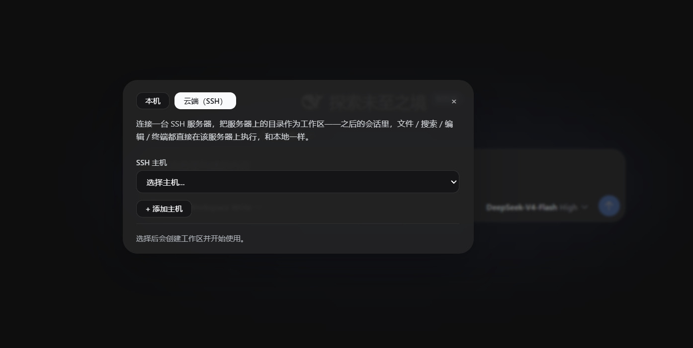
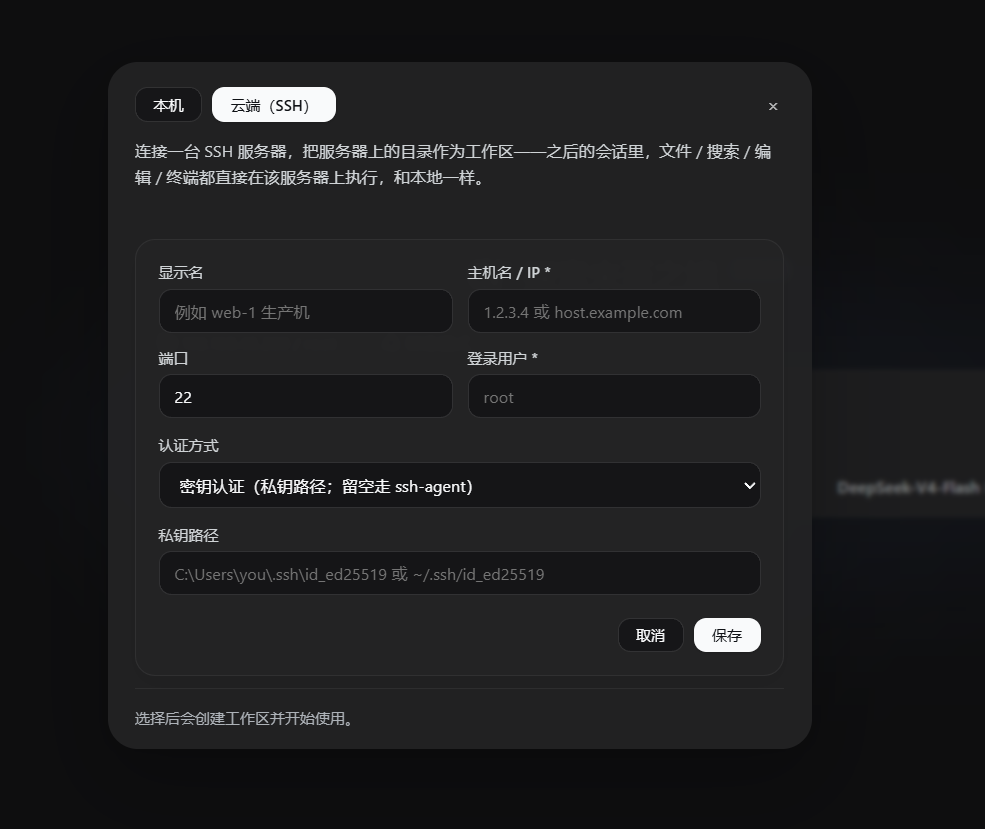
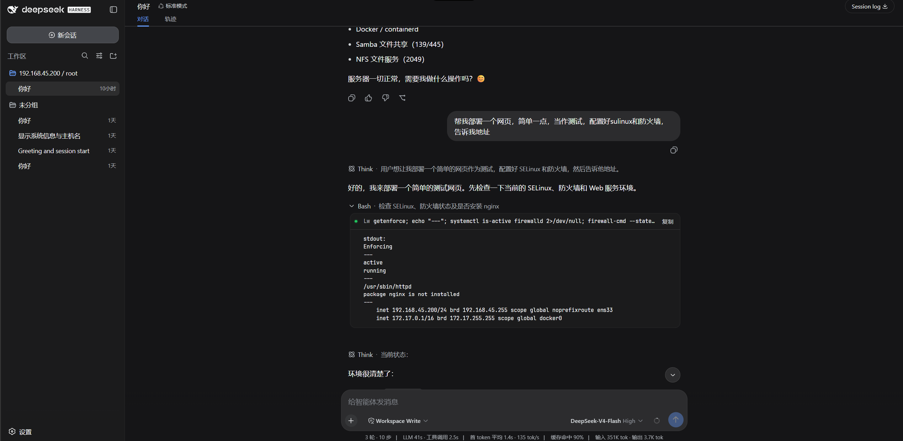

# dsh-cloud-workspaces

[](LICENSE)
[](#development)

**Cloud workspaces for [DeepSeek Harness](https://github.com/deepseek-ai/deepseek-harness) (DSH).**

Pick **Cloud (SSH)** in DSH's workspace picker, and the coding agent works directly on your Linux server: `bash`, `read`, `write`, `edit`, `glob`, `grep` — the entire built-in toolset — transparently execute over SSH. Files, search, editing and terminal all live on the remote box.

**Zero install on the server.** No vscode-server-style remote agent, no daemon, nothing to download — a standard OpenSSH server is all it takes.

<p align="center">
  
  
</p>
<p align="center">
  
</p>

> 中文文档：[README.zh-CN.md](README.zh-CN.md)

---

## Why

DSH's agent runs on your local machine. When your code, data or production box lives on a remote Linux server, you either SSH in separately or fight with sync tools. Competing remote solutions ship a fat remote component (hundreds of MB) that must be downloaded to the server on first connect.

`dsh-cloud-workspaces` takes a different route: everything rides **standard SSH channels** (exec / SFTP / PTY via [ssh2](https://github.com/mscdex/ssh2)). The server needs nothing beyond what it already has.

## Features

### Cloud workspaces (the headline)

- **Dual-tab workspace picker** — "Local" and "Cloud (SSH)" tabs; cloud workspaces are adopted by DSH's official workspace registry and show up in every session picker as `host / path`.
- **Transparent toolset redirect** — when a session's cwd falls under a cloud placeholder, the plugin replaces the official `ctx.fs` (13 file methods) and `ctx.subprocess` seams with SSH-backed implementations. Local sessions are untouched; the seam is swapped per session scope.
- **Shadow tools with official UI** — session-scoped remote `bash` / `read` / `write` / `edit` / `glob` / `grep` register in the agent's scope only, and implement the official `presentCall` / `presentResult` presenters, so chat rows render as real terminal / read / search cards — expandable, copyable, native.

### SSH settings card (in DSH Settings → SSH Connections)

- **Host manager** — display name, host, port, user; **password auth** (keyboard-interactive aware — works with PAM/Ubuntu servers that never offer the plain `password` method) or **private key** (path; ssh-agent fallback).
- **Connection test** — one-click probe with latency; saved credentials are reattached server-side (the browser only ever sees a redacted view).
- **Remote directory browser** — list, navigate, **create** and **delete** folders on the server; then **bind any directory as a cloud workspace** in one click.
- **ProxyJump** — jump-host chains, per-hop credentials.

### Agent tools

- `ssh_list` / `ssh_exec` / `ssh_ls` / `ssh_read` / `ssh_write` — explicit remote access from any session (subject to preset scoping).
- `ssh_workspace` — create a cloud workspace binding from chat.

### Connection layer

- ssh2 connection pooling with keepalive, broken-connection detection and transparent rebuild.
- Per-host latency-tested `test` endpoint reused by both the settings card and the picker.

### Security

- Hosts are stored in DSH's settings namespace; password fields are **write-only secrets** — the browser receives a redacted view and can never read stored credentials back.
- Remote sessions are scoped: shadow tools exist only inside sessions bound to a cloud workspace. Local workspaces are never affected.
- Remote file reads are capped; large files stream instead of buffering into memory.

## Install

Requires DSH (web profile), Node ≥ 22, and a reachable SSH server.

### From npm

```sh
dsh plugin --profile web add dsh-cloud-workspaces
```

### From source

```sh
git clone https://github.com/harryopo/dsh-cloud-workspaces.git
cd dsh-cloud-workspaces
pnpm install
pnpm build

# link into the DSH web profile (use a junction on Windows if the path has spaces)
dsh plugin --profile web add link:C:\path\to\dsh-cloud-workspaces
```

Restart `dsh web` after installing or rebuilding (the host half loads in the Node process).

## Usage

1. **Add a host** — Settings → SSH Connections → *Add host* → fill credentials → *Test* → *Save*.
2. **Bind a cloud workspace** — *Add workspace* → **Cloud (SSH)** tab → pick host → browse to your project → *Use this directory as workspace*.
3. **Open a session on that workspace** — the agent now runs entirely on the server. Ask it: `run pwd, then list the files here` and watch `bash` execute remotely.
4. Or drive it explicitly: `use ssh_exec to run docker ps on web-1`.

## Architecture

```
DSH host process (Node)
┌────────────────────────────────────────────────────────────┐
│  ctx.fs ────────► fs-ssh adapter ──────┐                    │
│  ctx.subprocess ► subprocess-ssh ──────┤   seam swap per    │
│  shadow tools ─► session scope ────────┘   session scope   │
│                                          │                 │
│  SshEngine (ssh2) ◄──────────────────────┘                 │
│   ├─ connection pool / keepalive / rebuild                 │
│   ├─ exec · SFTP CRUD · PTY                                │
│   └─ ProxyJump hops                                        │
└──────────────┬─────────────────────────────────────────────┘
               │ SSH (exec / sftp / pty)  — nothing else
        ┌──────▼──────┐
        │ Linux server │  stock sshd. zero remote install.
        └─────────────┘

Browser (dsh web GUI): settings card + cloud-workspace picker
speak to the host over the official Typert remote bridge.
```

- **Host half** (`src/`, TypeScript): `SshEngine`, `fs-ssh` / `subprocess-ssh` adapters, session tool registration, Typert remote endpoints, settings schema.
- **Client half** (`client/`, plain ESM React via `createElement`): settings section + dual-tab workspace picker injected through official slots (`settings.section`, `workspace.*`). No JSX build step, `--dsw-*` design tokens only.

## Development

```sh
pnpm build        # tsc d.ts + tsdown bundle
pnpm typecheck    # tsc --noEmit
pnpm test         # vitest — 100 unit tests
node scripts/e2e-real-server.mjs   # 25 E2E tests over a real SSH server (WSL sshd on 127.0.0.1:2223)
```

## Roadmap

- [x] SSH engine: pooling, keepalive, broken-connection rebuild, ProxyJump
- [x] Cloud workspaces: dual-tab picker, placeholder dirs, official adoption
- [x] Transparent `ctx.fs` / `ctx.subprocess` redirect
- [x] Shadow tools with official terminal/read cards
- [x] Settings card: hosts, password/key auth (keyboard-interactive), test, remote dir browser
- [ ] Background remote jobs (`ctx.jobs`)
- [ ] Remote search tuning (ripgrep detection on the server)
- [ ] SSH tunnel (local port forwarding)
- [x] npm first release (`dsh-cloud-workspaces@0.2.1`)

## Acknowledgements

- [DeepSeek Harness](https://github.com/deepseek-ai/deepseek-harness) — the harness and its official plugin SDK (`@deepseek-ai/dsh-*`); this plugin builds only on official npm SDK packages.
- [dsh-ssh](https://github.com/dsh-ssh/dsh-ssh) (Apache-2.0) — UI patterns for the settings card and workspace placeholder design.
- [ssh2](https://github.com/mscdex/ssh2) (MIT) — the SSH transport.

## License

[Apache-2.0](LICENSE)
