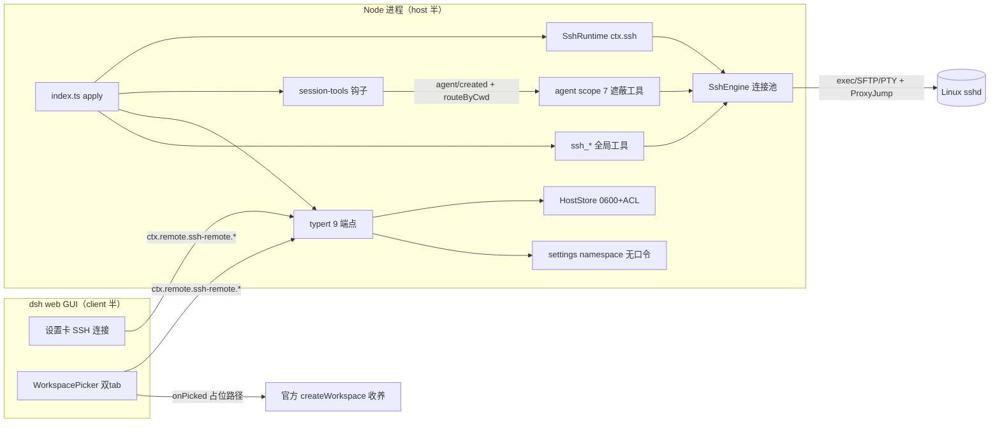

# Repo Wiki — dsh-cloud-workspaces

> 生成：2026-09-18 · 基线 commit `7450806`（f111ed3 加固 + 文档对齐）· 105/105 测试全绿实测
> 来源：全仓库文件逐个读取核验（src 15 文件 / client / tests 10 / scripts 3 / docs / config / memory）；未标注处均有代码依据，推断处标【信息缺失】或 ⚠️。

## 1. 项目概述

- **定位**：DeepSeek Harness（DSH）的「云端工作区」双面插件。用户在「添加工作区」选「云端（SSH）」→ 绑定远程目录为工作区 → 该会话的官方工具（bash/read/write/edit/glob/grep + read_image）**透明落远程 Linux 服务器**，与本地体验一致。
- **业务目标**：免 preset、免远程安装（标准 sshd 即可，无 vscode-server 式远端组件）的 agent 远程开发；差异化 = 全生态唯一的「官方工具透明重定向」（竞品靠镜像同步或私有工具名）。
- **技术栈**：TypeScript 5.7.2 · Node ≥22（es2024）· ssh2 1.17.0 · Cordis 4.0.1（DI/Scope/事件总线）· @deepseek-ai/* 0.1.1-rc.2（peer，运行时从 profile 解析）· tsdown 0.22.2（打包）· vitest 3.2.7 · schemastery 3.x。
- **运行/部署**：`dsh plugin --profile web add dsh-cloud-workspaces`（npm）或 `link:` 源码；`dsh web --port 4500` 承载；host 半改动需重启 web 进程。发布：npm `dsh-cloud-workspaces`（线上 0.2.1，本地 0.2.2 待发）+ GitHub `harryopo/dsh-cloud-workspaces`（Apache-2.0）。
- **命名注意**：包名/仓库已改 `dsh-cloud-workspaces`，**内部标识全部保留旧名 `dsh-remote-ide`**（settings namespace、存储文件、typert 前缀、cordis 插件名）以保数据兼容——新代码勿改。

## 2. 仓库目录结构

```
├── AGENTS.md              ★ 交接总纲（架构/命令/坑/状态）——任何 AI 先读
├── CLAUDE.md              AGENTS.md 摘要指针
├── README.md / README.zh-CN.md   对外产品文档（双语 + 3 截图）
├── CONTRIBUTING.md        ⚠️ 过时（描述已删除的浏览器面板架构）
├── package.json           双面插件声明：exports + dsh.bundle.patch + dsh.client
├── cordis.patch.yml       profile bundle 插入行（挂载点）
├── tsdown.config.ts       host 半 6 入口 ESM 打包（external 全部 @deepseek-ai/*）
├── tsconfig[.build].json  strict + lib/types 声明输出
├── vitest.config.ts       tests/**/*.test.ts，node 环境
├── pnpm-workspace.yaml    allowBuilds（ssh2/node-pty 原生编译白名单）
├── src/                   host 半（详见 §3 模块表）
│   ├── index.ts           入口 apply：装配全部
│   ├── session-tools.ts   ★ 免 preset 核心竞争力（agent/created 钩子 + 7 遮蔽工具）
│   ├── engine.ts          ★ ssh2 引擎（连接池/执行/SFTP/PTY/跳板）
│   ├── ssh-service.ts     SshRuntime（ctx.ssh 唯一连接所有者）
│   ├── tools.ts           6 个全局 ssh_* 工具
│   ├── typert.ts          9 个跨半 RPC 端点 + 口令迁移
│   ├── host-settings.ts   settings namespace/schema/脱敏/桥接 payload
│   ├── store.ts           主机配置 0600 存储（ACL/导入/防污染）
│   ├── workspace.ts       占位工作区路由（纯函数 + 可注入 IO）
│   ├── jsonsafe.ts        边界净化（lossless JSON）
│   ├── debug-log.ts       文件诊断日志（512KiB 轮转）
│   ├── protocol.ts        共享类型（+ ⚠️ 死常量 REMOTE_API）
│   ├── invariant.ts       空不变量伴侣插件（官方惯例占位）
│   ├── fs-ssh.ts          [legacy] ctx.fs seam 替换（参考，不部署）
│   └── subprocess-ssh.ts  [legacy] ctx.subprocess seam 替换（参考，不部署）
├── client/index.js        client 半：设置卡 + 双 tab 选择器（createElement，无 JSX）
├── agent-presets/remote-legacy/  [已下线] 旧 preset 模板
├── scripts/               e2e-real-server.mjs（25 项真机验收）/ debug-spawn.mjs / start-dsh-web.ps1
├── tests/                 vitest 105 用例（fake ssh2 harness）
├── docs/                  03 方案书（纲领）/ 06 开发方法论 / screenshots/ / REPO-WIKI.md（本文件）
└── memory/                项目记忆（编年进展/踩坑/用户画像/UI 决策/生态参考）
```

## 3. 模块架构与调用关系

| 模块 | 职责 | 依赖 |
|---|---|---|
| `index.ts` | 装配：起 SshRuntime → 注册 ssh_* 工具（sync 受 enabled/announceToAgent 开关）→ 两段 systemPrompt（全局宣告 + 会话动态段）→ inject(typert,settings) 挂载设置面 → installSessionRouting | 全部 |
| `session-tools.ts` | `ctx.on('agent/created')` → `routeByCwd(cwd)` 命中占位 → **仅在 `payload.agent.ctx`（agent scope）**注册 7 遮蔽工具 + `runtime.connect(hostId)` 预热切 activeAlias；isEnabled 事件时求值 | engine/workspace/jsonsafe/debug-log |
| `ssh-service.ts` | Service `ctx.ssh`：connect/disconnect/getConnection（broken 或陈旧 rejection 自动重建）/getConnectionFor（多主机不切激活）/wrap 句柄/disposal 守卫 | engine/store |
| `engine.ts` | 连接池（Map<alias,PoolRecord> + connecting 在途去重）/keepalive/sweep 空闲回收（inFlight 守卫）/exec（超时+输出 cap）/openChannel 流式/openShell PTY/SFTP CRUD（readFile 流式 cap、writeFile 自动建父目录、posix-rename）/ProxyJump 链/keyboard-interactive | ssh2/store |
| `store.ts` | `~/.dsh/dsh-remote-ide.json`（0600 + Windows icacls 断继承）；upsert 校验（isSafeHostId 防原型污染）；`~/.ssh/config` 导入 | protocol |
| `workspace.ts` | 占位路径 `<DSH_HOME|~/.dsh>/remote/<hostId>/<base64url(远程绝对路径)>`：编解码可逆、routeByCwd、resolveRemotePath（占位绝对路径重锚回远程）、manifest、listPlaceholders | 纯函数+注入 fs |
| `typert.ts` | 9 端点（listHosts/saveHost/deleteHost/testConnection/listRemoteDir/mkdirRemote/removeRemote/createPlaceholder/listPlaceholders）；口令唯一权威=store，启动一次性迁移 settings 明文→store；createPlaceholder 后台注册 workspaceRegistry（5s 超时不阻塞） | engine/host-settings/workspace/jsonsafe |
| `host-settings.ts` | settings namespace `dsh-remote-ide-hosts`（hosts dict；口令永不落 settings）；redactHosts/hostsOf(过滤污染键)/toHostPayload(auth 缺省=保 store 既有) | dsh-settings/schemastery |
| `tools.ts` | 全局 `ssh_list/ssh_exec/ssh_ls/ssh_read/ssh_write/ssh_workspace`（resolveAlias：显式 alias 优先，回退 activeAlias） | ssh-service/workspace/jsonsafe |
| `client/index.js` | 设置卡 SshHostsSection + WorkspacePicker（本机/云端双 tab，onPicked 官方收养）；typert 描述符镜像；withTimeout/safeCall/slugId/seq 守卫 | 官方 slots/remote |
| `jsonsafe.ts` / `debug-log.ts` | 边界净化 / 文件诊断（跨边界输出必过 jsonSafe；scope.logger 不落盘） | — |
| `fs-ssh.ts` / `subprocess-ssh.ts` | legacy 真 seam 路线参考（13 方法 FileSystem / wrapper 协议 SubprocessRuntime），仅 remote-legacy preset 挂载 | ssh-service |



**核心数据流**：选云端目录 → `createPlaceholder`（建占位 + 写 manifest + 后台注册）→ `onPicked(占位路径)` 官方收养 → 新会话 cwd=占位 → 钩子命中 → 遮蔽工具 + 动态 prompt + connect 预热 → agent 调 bash/read/… → `resolveInSession` 重锚定 → engine 落远程。

## 4. 已实现能力清单【防重复造轮子】

**引擎层（engine.ts）——任何远程操作都从这里走，勿另起 ssh2 Client**
| 能力 | 入口 | 说明 |
|---|---|---|
| 连接池+并发去重 | `ensureConnection(alias)` | connecting Map 在途合并；broken 自动重建 |
| 空闲回收 | 内部 `sweep()` | 30min 空闲、inFlight>0 或激活主机豁免 |
| 命令执行 | `exec(alias,cmd,{cwd,timeoutMs})` | 输出 2MiB 截断、超时 close、cd 前缀 quoteSh |
| 流式通道 | `openChannel(alias,cmd)` | SshExecChannel 事件缓冲（subprocess 用） |
| PTY | `openShell(alias,cols,rows)` | ShellSession（onData/send/resize/pause/close），error+close 单次释放 |
| SFTP | `ls/readFile/writeFile/mkdir/remove/rename/getSftp` | readFile 超限流式只读头部；writeFile ENOENT 自动建父目录；二进制 NUL 嗅探 |
| 跳板链 | `connectHops` | ProxyJump 多跳、sock 传递、失败统一 finally 释放 |
| 探测 | `test(alias)` / `testConfig(cfg)` | 含 keyboard-interactive（PAM 服务器） |
| 转义 | `quoteSh(v)` | POSIX 单引号惯用法，所有插值必过 |

**会话路由（session-tools.ts）**：`installSessionRouting(ctx,runtime,isEnabled)`（agent scope 守卫，绝不全局）；`buildSessionTools`（7 工具，参数名对齐官方）；`sessionSectionText`（本地会话返回空串零注入）；presenters：`bashTerminalView`/`readCardView`（官方富 UI 展开的前提）。

**占位工作区（workspace.ts）**：`remoteRoot()`（env 可覆盖）、`isValidHostId`、`encode/decodeRemotePath`（base64url 可逆+规范编码校验）、`mapRemoteToLocal/mapLocalToRemote`、`routeByCwd`、`resolveRemotePath`、`createPlaceholderDir`（幂等+manifest）、`listPlaceholders`、`readManifest`。

**存储与安全（store.ts/host-settings.ts/typert.ts）**：0600+icacls ACL 收紧、`isSafeHostId` 原型污染防护（store 键 + settings 读取双侧过滤）、口令 write-only 边界（wire 脱敏 + settings 不落口令 + 启动迁移）、`~/.ssh/config` 导入、`getStoredEntry`（host 平面内部补回口令专用，绝不进 wire）。

**边界工具**：`jsonSafe`（所有 typert 端点 return + 工具 execute return 必包）；`debugLog`（512KiB 轮转，`~/.dsh/dsh-remote-ide-debug.log`）。

**client 半交互件（可复用模式）**：`withTimeout(p,ms,label)`、`safeCall` 语义的 `svc()` 守卫、`slugId` 唯一 id、`useRef` seq 竞态守卫、`useStore` 订阅、目录浏览器（浏览/新建/删除/绑定）、双 tab 选择器（pickDirectory 官方原生框 + 云端级联浏览 + 内联 HostForm）、Escape 关闭。

**测试基建**：`vi.mock('ssh2')` + MiniEmitter/FakeClient/FakeStream 可编程假传输（connect 行为可控 ready/error、instances 计数）——新引擎测试直接复用此模式。

**脚本**：`e2e-real-server.mjs`（25 项真机全链路验收，驱动 lib/ 产物 + 真实 cordis Context）；`debug-spawn.mjs`（wrapper 发布诊断）；`start-dsh-web.ps1`（4500 一键起）。

**接口（typert 9 端点 + 6 全局工具 + 7 遮蔽工具）**：见 §5/§3；host 贡献与 client 描述符一一对应（已核验 9=9）。

## 5. 核心 API & 公共函数文档

| 函数/接口 | 作用 | 入参 | 返回 | 注意事项 |
|---|---|---|---|---|
| `SshEngine.exec` | 远程执行一条命令 | alias, command, {cwd?,timeoutMs?} | `ExecResult`（exitCode 可为 null） | 默认 60s 超时、2MiB 输出截断；cwd 自动 `cd <quoted> &&` |
| `SshEngine.readFile` | 远程文本读 | alias, path | `{content,truncated,size,mtimeMs}` | 超 maxReadBytes 流式只读头部；NUL→抛 binary |
| `SshEngine.writeFile` | 远程文本写 | alias, path, content | `{size,mtimeMs}` | ENOENT 时自动建缺失父目录后重试一次 |
| `SshRuntime.getConnection()` | 当前激活目标句柄 | — | `SshConnection`（alias 隐藏语义） | 失败自动重建一次；disposed 抛错 |
| `SshRuntime.getConnectionFor(alias)` | 指定主机句柄（不切激活） | alias | `SshConnection` | 多主机路由用；wrap 缓存 |
| `SshRuntime.connect(alias)` | 设激活目标并建连 | alias | `WorkspaceStatus` | 幂等（池去重）；切走旧连接保活但解绑 |
| `routeByCwd(cwd)` | 会话路由判定 | cwd | `{kind:'local'}｜{kind:'remote',hostId,remoteCwd}` | 恰好两段才命中；绝不抛错 |
| `resolveRemotePath(p,cwd,placeholder)` | 路径解析/重锚定 | 相对或绝对 | posix 绝对路径 | 词法规范化（containment 模型，不解析 symlink） |
| `createPlaceholderDir({hostId,remotePath})` | 建占位+manifest | — | `{localPath,hostId,remotePath}` | 幂等；hostId 校验绝对路径校验 |
| `jsonSafe(v)` | 剥 undefined 边界净化 | 任意 | 同形 | 跨边界输出一律包；数组内 undefined 也剥 |
| `quoteSh(v)` | shell 单引号转义 | string | `'…'` | 所有远程命令插值必过 |
| `isSafeHostId(id)` | 主机 id 白名单 | string | bool | 拒 `__proto__/constructor/prototype`；字母数字开头 |
| `SshRemoteService.saveHost(id,patch)` | 建/改主机 | id, 部分配置 | `{id}` | 口令只进 store；store 失败则 settings 不落 |
| `installSessionRouting(ctx,runtime,isEnabled?)` | 装会话钩子 | — | void | 只注册进 agent scope；异常全吞 |
| `debugLog(msg)` | 文件诊断 | — | void | 512KiB 自动重置；失败静默 |

## 6. 配置项 & 环境变量

**插件 Config（settings namespace `dsh-remote-ide`）**：`enabled`(true) 总开关（工具注册+钩子事件时求值）；`maxReadBytes`(2MiB, 64KiB–64MiB)；`announceToAgent`(true) 全局宣告段。
**SshRuntime Config**：`idleTimeoutMs`(30min)、`connectTimeoutMs`(15s→ssh2 readyTimeout)、`keepaliveIntervalMs`(15s)、`maxOutputBytes`(2MiB)、`defaultExecTimeoutMs`(60s)、`maxReadBytes`(2MiB)、`storeFile`(空串=默认)。
**环境变量**：`DSH_REMOTE_ROOT`（占位根覆盖，最高优先级）> `DSH_HOME/remote` > `~/.dsh/remote`；`USERNAME`（icacls 授权当前用户）；`USER`（ssh-config 导入兜底用户）。
**文件**：`~/.dsh/dsh-remote-ide.json`（0600+ACL，口令唯一权威）；`~/.dsh/dsh-remote-ide-debug.log`；`~/.dsh/settings.yaml` 的 `dsh-remote-ide-hosts`（无口令）；`~/.dsh/remote/<hostId>/<b64>/`（占位+.dsh-remote-workspace.json manifest）。
**构建**：tsdown 6 入口 external 全部 @deepseek-ai/*；build 脚本先删 lib 再 tsc（防 d.ts 被 clean，坑 6）。

## 7. 依赖库与相关官方资料摘要

- **ssh2 1.17**：`Client.connect(ConnectConfig)` 支持 `readyTimeout/keepaliveInterval/tryKeyboard`；`keyboard-interactive` 事件需主动 finish(prompts)（PAM 服务器只给 ki 不给 password）；exec channel `close(code, signal)` 携带 exit-status；**SFTP RENAME 协议不覆盖已存在目标**（OpenSSH 返回 Failure）→ 覆盖写走 `ext_openssh_rename`（posix-rename@openssh.com，@types 未声明）；`createReadStream(path,{start,end})` 做区间读。
- **@deepseek-ai/cordis 4.0**：Service/Scope/effect 生命周期；`ctx.on(event, cb)` 事件总线（**AgentRegistry 服务上没有 on**）；0.1.1 强制 inject 检查——自提供服务不可声明进 inject（自等死锁），用 `ctx.get()`。
- **@deepseek-ai/dsh-tools**：`defineTool` 参数校验 + 输出 schema 严格对齐（additionalProperties:false 会拒多余键）；`presentCall/presentResult` 富 UI 视图（presentation.d.ts：terminal/generic/diff 呼叫视图，terminal/read/search/diff/web 结果视图；包装层先校验 args，非法软降级 undefined）。
- **@deepseek-ai/dsh-settings**：递归 merge 只深合 dict 不删键（删除须 `mutate unset`）；`role('secret')` **只保护 wire 面，不保护落盘**（09-05 审计根因）。
- **dsh-typert-protocol/网关**：结果 `{ok,value}` 信封（端点返回裸业务值，勿双层包装）；`assertJsonValue` 拒任何 undefined own-value；`validateBinding` 要求 `bindTypertRemote`。
- **@deepseek-ai/dsh-workspace**：`registry.create(path,title)` 依赖 sessionPersistence 引导，可能永不就绪——await 须加超时（真机卡退教训）。
- **schemastery 3.x**：无 `.optional()`，以 `.default('')` 表达缺省。
- 契约权威源 = 全局 dsh 包**内层** `node_modules/@deepseek-ai/*/lib/types/*.d.ts`（外层 lib/ 是引导 stub）；本地 DSH 源码 `.research/`（rc.5，仅历史参考）。

## 8. 技术债务、限制、TODO 清单

**发布/决策（待用户）**：① npm 0.2.2 未发布（本地 0.2.2 vs 线上 0.2.1；令牌过期）② `~/.dsh` 目录 ACL 断继承待决策（影响沙箱工具读取）。
**架构限制**：单 `activeAlias` 全局语义——多主机多会话时 ssh_* 无别名回退跟随最后激活者（遮蔽工具不受影响）；`connect()` 失败路径建 2 个传输对象（瞬时浪费不泄漏）；M0 遗留：broken 重建成功后 engine state 语义未统一。
**功能缺口**：`ssh_workspace` create 不注册 workspaceRegistry（typert 路径有）；远端删除用原生 `window.confirm`；选择器关闭后状态保留；`fs-ssh` 的 createIfAbsent 依赖 GNU `ln -T`。
**文档漂移**：`CONTRIBUTING.md` 整篇过时（描述已删除的浏览器面板/gen:css/routes.ts）；`docs/README.md` 里程碑状态停在 M4 前；README「100 unit tests」实为 105、Security 节「口令在 settings namespace」措辞未跟上 09-05 收敛；`protocol.ts` 的 `REMOTE_API*` 常量已死（仅测试引用）；`session-tools.ts:450` 一行孤儿注释。
**测试缺口**：subprocess 锚定回归被 Mimosa 钩子拦截未补（E2E 覆盖）；readFile/writeFile 新分支无单测（E2E 覆盖）。
**Roadmap（README 未勾）**：后台远程任务 `ctx.jobs`、服务器 ripgrep 探测调优、SSH 隧道（本地端口转发）。
**已知坑 12 条**：全列于 AGENTS.md（WinNAT 端口/junction 空格/tsdown clean/Mimosa 误报/同文件串行/vitest fake 泄漏/搜内层/lefthook 死钩子…）。

## 9. 复用开发指引

**先查这里再造**：
- 要远程执行/读写/列目录/PTY → `SshEngine` 已有全套（§4 引擎表），**绝不新建 ssh2 Client 或复制连接逻辑**；连接生命周期只经 `SshRuntime`。
- 要处理占位路径/相对解析/重锚定 → `workspace.ts` 纯函数族（可注入 IO，直接单测）。
- 要新增 agent 工具 → 抄 `tools.ts` 任一工具形状：defineTool + 参数名对齐官方 + `jsonSafe` 包 return + `quoteSh` 包一切插值 + 富 UI 加 presenters。
- 要新增设置卡能力 → typert 三处同步：`HOST_TYPERT_CONTRIBUTION.invocations` + `SshRemoteService` 方法 + client `desc(...)` 列表；返回裸业务值 + jsonSafe。
- 要新增 client UI → `client/index.js` 模式库：createElement（禁 JSX）、`--dsw-*` 成对 token、`withTimeout`/`svc()`/`slugId`/seq 守卫、`store.set` 错误可见。
- 要写引擎测试 → 复用 `tests/engine-connection.test.ts` 的 FakeClient 骨架（注意每 describe 自带 beforeEach 清 instances）。
**边界纪律**：跨边界输出过 jsonSafe；遮蔽能力只进 agent scope；口令只进 store；同文件编辑串行；改 host 半后重启 4500 前先确认无承载会话。
**风格**：strict TS 无 any 滥用、`!== undefined` 显式判缺省、注释中文写「为什么」、错误消息面向 agent（可操作提示）、commit 用 conventional 前缀。

## 10. Wiki 检索索引

| 关键词 | 去哪 |
|---|---|
| 连接池/重连/sweep/跳板/PTY/SFTP | §4 引擎层 → `src/engine.ts` |
| 遮蔽工具/agent/created/钩子不生效 | §3 session-tools → `src/session-tools.ts`；诊断 `~/.dsh/dsh-remote-ide-debug.log` |
| 占位路径/base64/重锚定/manifest | §5 → `src/workspace.ts` |
| 口令/ACL/原型污染/迁移 | §4 存储与安全 → `src/store.ts` `src/typert.ts` `src/host-settings.ts` |
| 设置卡/选择器/双 tab/typert 端点 | §3 client/typert → `client/index.js` `src/typert.ts` |
| 工具行不能展开/presenters | §7 dsh-tools 条 → `session-tools.ts` presenters |
| jsonSafe/lossless JSON/网关拒绝 | §7 网关条 → `src/jsonsafe.ts` |
| 构建/打包/external/d.ts 被清 | §6 → `tsdown.config.ts` + AGENTS 坑 6 |
| 测试 fake/vitest 泄漏 | §9 → `tests/engine-connection.test.ts` |
| E2E/真机验收 | §4 脚本 → `scripts/e2e-real-server.mjs` |
| 里程碑/历史/踩坑全文 | `memory/project_dsh_remote_ide.md`（顶部最新）、`memory/errors_learnings.md`、AGENTS.md |
| 方法论/seam 契约/preset 机制 | `docs/06-DSH插件开发方法论.md`；纲领 `docs/03-方案书…md` |
